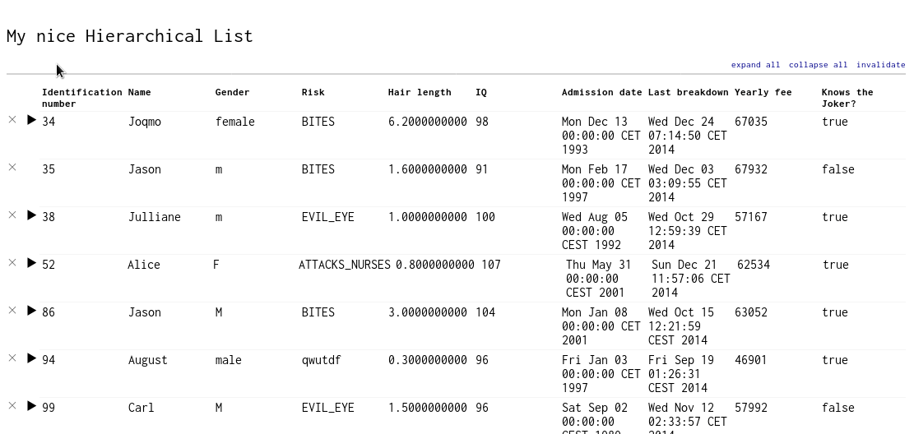

# Hierarchical List

Implementation of a hierarchical list structure in React & Redux.

[Check it out!](https://talkdirty.github.io/hierarchical-list/)



## Features

* Transform recursive input Json into flat immutable data structure
* Expand and collapse subhierarchies
* Reset data

## Technologies used

#### scaffolding

The project was bootstrapped with [create-react-app](https://github.com/facebook/create-react-app).

#### unit tests

Unit tests are executed with [jest](https://facebook.github.io/jest/). For testing the react components, [enzyme](https://github.com/airbnb/enzyme) is used. For testing with redux, [redux-mock-store](https://github.com/arnaudbenard/redux-mock-store) is used.

#### static type checking

Static type checking is provided by [flow](https://flow.org/).

#### state management

State management is provided by [redux](https://redux.js.org/). For organizing the state, the redux [ducks](https://github.com/erikras/ducks-modular-redux) proposal was followed. Immutable data structures courtesy of [immutable.js](https://facebook.github.io/immutable-js/) are used in the store.

#### side effect model

For side effect management [redux-saga](https://github.com/redux-saga/redux-saga) is used. Strictly speaking, this is not required for the project (as the input json is not required to change, we could just import the json through webpack), but I figured loading the json asynchronously makes the project a bit more exciting.

#### css preprocessor

[Sass](https://sass-lang.com/) is used as a CSS preprocessor.

#### isolated component development

[Storybook](https://github.com/storybooks/storybook) is used for isolated component development, though this would not have been strictly necessary, as there are very few components in the App.

## Usage

Nothing out of the ordinary here:

#### Running

```bash
yarn install
yarn start
```

#### Executing Unit tests

```bash
yarn test
```
